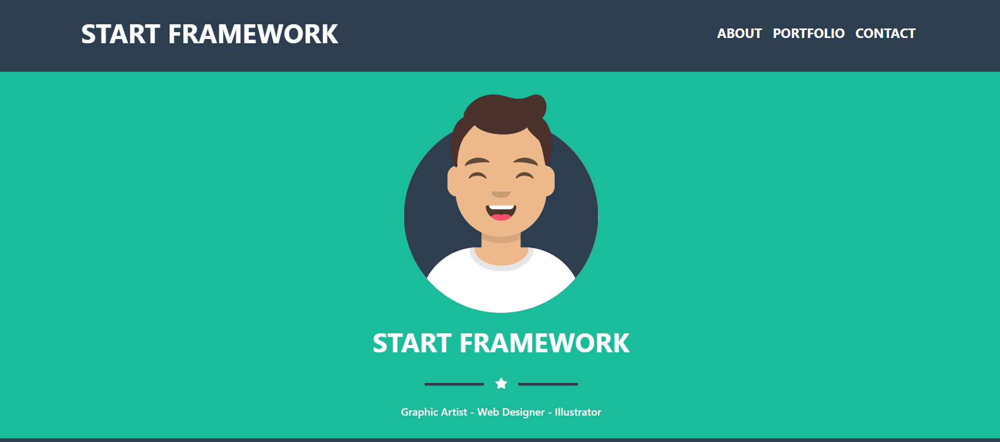

# 🛠️ Start Framework - React UI Template

A clean, responsive React starter template built using Bootstrap 5.  
Perfect for quick prototyping, landing pages, or starting a scalable front-end project.

---

## ✨ Features

- ⚡ Responsive and mobile-friendly layout
- 📁 Organized folder structure for easy scaling
- 🎨 Bootstrap 5 integrated
- 🔤 FontAwesome icons ready
- 🚦 Smooth navigation with React Router
- ❌ Custom 404 Not Found Page
- 💫 Custom input animations and floating placeholders

---

## 📸 Preview



---

## 🚀 Getting Started

Clone the repo and run:

```bash
npm install
npm start
